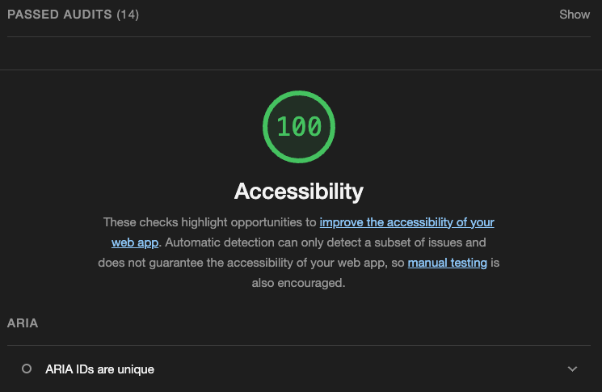

# Jim Macur's Professional Portfolio

Welcome to the repository for **Jim Macur's Professional Portfolio**! This site showcases my projects, skills, education, and experience as a fullstack developer. Built with modern web technologies, the portfolio emphasizes accessibility, responsive design, and user engagement.


## Table of Contents

- [Live Site](#live-site)
- [Features](#features)
- [Technologies Used](#technologies-used)
- [Getting Started](#getting-started)
  - [Installation](#installation)
  - [Running the Project](#running-the-project)
- [Project Structure](#project-structure)
- [Accessibility](#accessibility)
- [Contact](#contact)
- [License](#license)

---

## Live Site

Check out the live version of the portfolio here:  
[**Jim Macur's Portfolio**](https://jim-macur-portfolio.vercel.app/)

---

## Features

- **Responsive Design**: Works seamlessly on desktop, tablet, and mobile devices.
- **Interactive Elements**: Smooth scrolling, hover effects, and subtle animations enhance user experience.
- **Contact Form**: Integrated with **Formspree** to allow easy email communication.
- **Accessibility**: ARIA landmarks, focus indicators, and screen reader-friendly labels.
- **Back-to-Top Button**: Allows users to quickly navigate to the top of the page.
- **Projects Showcase**: Displays detailed information about projects, tech stacks, and contributions.
- **Education Section**: Highlights educational background with institution logos and program details.

---

## Technologies Used

- **Frontend**: React, TypeScript, Tailwind CSS
- **Form Handling**: Formspree
- **Icons**: React Icons (FontAwesome)
- **Accessibility**: ARIA landmarks, focus indicators
- **Animations**: Tailwind CSS animations and transitions

---

## Getting Started

Follow these steps to get a local copy of the project up and running.

### Prerequisites

Make sure you have the following installed:

- **Node.js** (v14 or higher)
- **npm** (v6 or higher)

### Installation

1. **Clone the repository**:

  ```bash
  git clone https://github.com/jimmacur/jim-macur-portfolio.git

  cd jim-macur-portfolio
  ```
2. **Install Dependencies**:

  ```
  npm install
  ```

3. **Start the Development Server**:

```
npm start
```

### Accessibility 

This portfolio follows accessibility best practices to ensure an inclusive user experience. Key features include:

•	ARIA Landmarks: Implemented role attributes and aria-labelledby for improved screen reader navigation, making it easier for users to understand and navigate the site structure.

•	Semantic HTML: Used appropriate HTML elements like headings `(<h1>, <h2>, etc.)`, lists, and sections to enhance the document’s structure and readability.

•	Descriptive Links: Included aria-label attributes for links and buttons to provide context for screen reader users.

•	Accessible Forms: Contact forms use label elements and aria-labelledby to ensure all form fields are properly associated and usable by assistive technologies.

These practices help make the portfolio accessible to a broader audience, including those using screen readers or navigating via keyboard.



### Contact

Feel free to reach out to me via:

•	Email: jim.macur@gmail.com

•	LinkedIn: [LinkedIn Profile](https://www.linkedin.com/in/jimmacur/)

•	GitHub: [GitHub Profile](https://github.com/jimmacur)